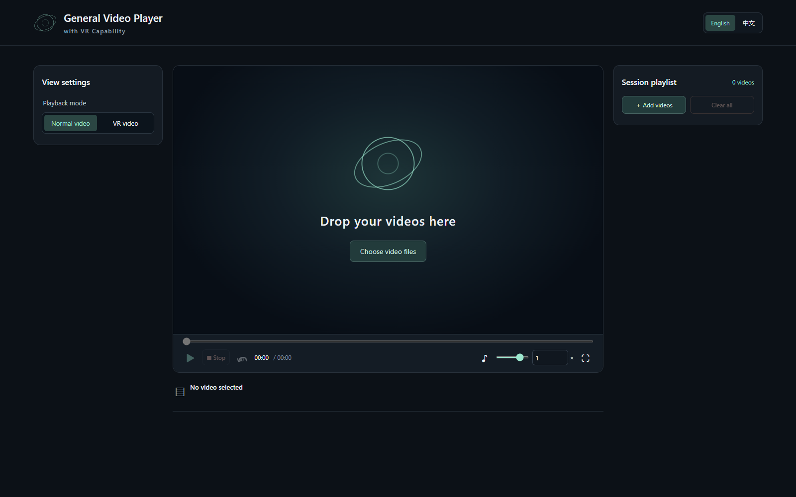
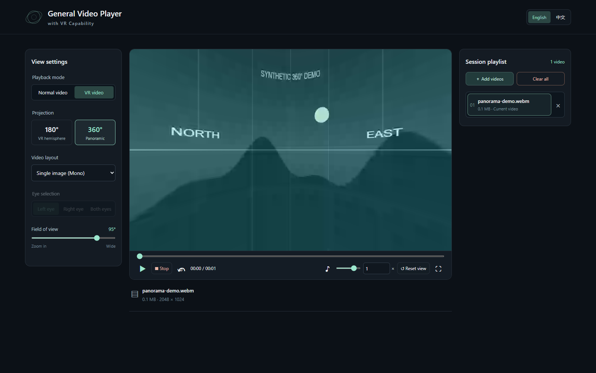

# General Video Player with VR Capability

English · [简体中文](README.zh-CN.md)

An offline, browser-based player for local videos and downloaded VR180 / 360° videos. Open `index.html` in your browser—no installation, account, server or uploads required.

## Features

- **Original-file playback:** reads your local file directly without transcoding, reducing its source bitrate, recompressing it or modifying it.
- **Normal video:** the default mode shows the complete image at its original aspect ratio, with seeking, volume and custom 0.25–4× playback speed.
- **VR playback:** equirectangular 180° / 360° projection; side-by-side, top/bottom or mono input; left, right or both eyes.
- **Interactive viewing:** drag to look around, scroll to zoom, and reset the view from the control bar.
- **Session playlist:** add or drop multiple files, select a video, remove individual entries or clear the whole session.
- **Fullscreen controls:** click or press Space to play/pause; double-click or press F for fullscreen. The translucent controls hide when idle.
- **English / 中文:** switch in the top-right corner, including settings, tooltips, status and error messages. English is the default; changing language preserves the current video and settings. Reloading returns to English.
- **Fully local:** no CDN, telemetry, backend or runtime packages.

Direct playback preserves the source file and its encoded bitrate. Displaying it still involves sampling for the window size and VR view; this does not promise pixel-for-pixel output, unchanged HDR or smooth playback of every high-bitrate video. Codec and audio support depend on the browser and operating system.

## Screenshots

Default English interface:



VR mode with a synthetic panorama:



These are screenshots of the actual application. The panorama is generated by the project demo script; it contains no personal footage and is not bundled with the player.

## Getting started

1. Download the player ZIP from [Releases](https://github.com/WiscOBKenobi/general-video-player/releases) and extract it completely. Alternatively, use **Code → Download ZIP** to download the source.
2. Open `index.html` in desktop Microsoft Edge or Google Chrome. Keep the accompanying files together, including `i18n.js`.
3. Select **Choose video files**, use **Add videos** in the playlist, or drag files onto the page.

| Source | Settings |
| --- | --- |
| Normal video | **Normal video** (default) |
| Side-by-side VR180 | **VR video → 180° → Side by side (SBS) → Left eye** or **Right eye** |
| Top/bottom VR | **VR video → matching projection → Top / bottom → Left eye** or **Right eye** |
| 360° panorama | **VR video → 360° → matching mono or stereo layout** |

**Space / click:** play or pause · **Double-click / F:** fullscreen · **← / →:** seek 10 seconds · **M:** mute · **R:** reset view. The speed field accepts decimals such as 1.05 or 1.1.

## Compatibility and privacy

- Containers, codecs and audio tracks are supported by your browser. A file extension does not guarantee playback; MKV or HEVC files may not decode.
- VR input must use equirectangular projection. Fisheye, EAC, cubemaps, WebXR headsets and transcoding are not supported. Browser graphics acceleration is required.
- External subtitles, audio-track selection, automatic next-video playback and resume history are not implemented. 4K/8K, HDR and all device/codec combinations have not been comprehensively tested.
- The playlist and language choice exist only in page memory. Stop, clear, reload or closing the page releases the media session without deleting your files.
- The player does not upload videos or persist playback history. **It cannot clear or prevent the browser's or operating system's own history and caches.** See the [session privacy notes (Chinese)](docs/SESSION_PRIVACY.md).

## Development

Playing videos does not require Node.js. Development checks require Node.js 20+, npm and Edge, Chrome or Playwright Chromium.

```sh
npm ci --ignore-scripts
npm run check
npm test
npm run test:chrome
npm run screenshots
npm run release:check
npm run package
```

On Windows, tests use Edge by default. Edge and Chrome each pass 35 checks, including projection pixels, playback interaction, language switching, fullscreen, session cleanup and unchanged source-file SHA-256. Synthetic test videos do not establish compatibility with every real-world file.

`test-results/`, `node_modules/`, `release/` and personal media are excluded from Git. `docs/images/` contains only reviewed public demo screenshots. Packaging uses an explicit allowlist and excludes test dependencies. See [contribution notes (Chinese)](CONTRIBUTING.md).

## License and attribution

[MIT License](LICENSE). The interface, controls and WebGL projection were developed for this project with AI assistance. File access and decoding use browser APIs. Online VR Player was a functional reference; its source and assets are not included. See [source and third-party notices (Chinese)](THIRD_PARTY_NOTICES.md).
